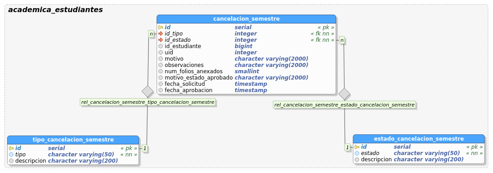

# oas_be_cancelacion_semestre
Este es el back-end del proyecto cancelación de semestre, es un API RESTful con la entidades creadas.

#REQUERIMIENTOS DE DESARROLLO
-----------------------------
- golang: https://golang.org/doc/install
- beego: http://beego.me/quickstart
- bee: https://github.com/beego/bee#installation
- docker: https://docs.docker.com/engine/installation/linux

Para tener el proyecto localmente se puede ejecutar:

1) Descargar el software a través del método ***go get***:
```bash
$ go get github.com/juusechec/oas_be_cancelacion_semestre
```
2) Ingresar al directorio del proyecto:
```bash
$ cd $GOPATH/src/github.com/juusechec/oas_be_cancelacion_semestre
```
3) Ejecutar una instancia de ***PostgreSQL*** en ***docker*** y ejecutar el script de generación de la base de datos:
```bash
$ newgrp docker
$ docker run -d -p 5432:5432 -e POSTGRESQL_USER=cancelacion_semestre -e POSTGRESQL_PASS=docker -e POSTGRESQL_DB=udistrital orchardup/postgresql
$ exit
$ psql -h localhost -d udistrital -U cancelacion_semestre -W < scripts/model/cancelacion_semestre.sql
```
4) Ejecutar el proyecto con ***bee*** y abrir la interfaz de ***swagger*** (swagger-ui) con el que se puede consumir el servicio REST con el navegador deseado:
```bash
$ bee run -downdoc=true -gendoc=true
$ xdg-open http://127.0.0.1:8080/swagger/
```
# PRUEBAS UNITARIAS
-------------------
Este proyecto basa las pruebas unitarias en un ejemplo recomendado por el autor de beego https://github.com/goinggo/beego-mgo
en el hilo https://github.com/astaxie/beego/issues/164, un buen artículo para generar test puede ser https://www.goinggo.net/2013/12/sample-web-application-using-beego-and.html

Se necesita instalar:
```bash
go get github.com/goinggo/tracelog
```

Para ejecutar las pruebas se puede hacer:
```bash
$ bee run &
$ cd tests
$ go test
```

El front-end del proyecto y las instrucciones de instalación se encuentran en https://github.com/juusechec/oas_fe_cancelacion_semestre

#MODELO
-------

